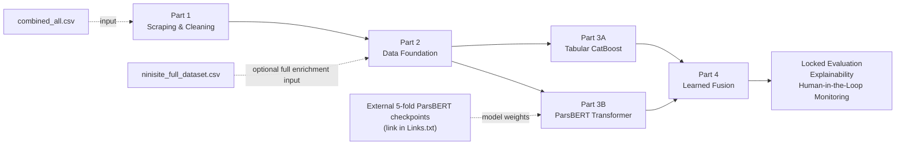

# Persian Pregnancy-Forum Stress Detection — Final Project Reproduction

This submission contains the complete project pipeline, organized into four sequential parts, together with the main datasets, the final report, and links to external resources that are too large to bundle directly.

## 1. Project structure

```text
Final_Project_Submission/
│
├── README.md
├── Links.txt
├── Report.pdf
│
├── Part1_Scraping_Cleaning_Pipeline/
├── Part2_Data_Foundation_Pipeline/
│
├── Part3_Tabular_Model_Pipeline/
├── Part3_Transformer_Model_Pipeline/
│
├── Part4_Fusion_Model_Pipeline/
│
└── All_Datasets/                        
    ├── combined_all.csv
    ├── ninisite_cleaned_enriched.csv
    ├── ninisite_cleaned_stress_proxy.csv
    └── ninisite_full_dataset.csv
```

Four parts of project are provided in this archive too:

`Project_Pipeline_All_Parts.zip`


---

# 2. START HERE — Required dataset and model placement

Before running the notebooks, place the large datasets and Transformer fold checkpoints in the locations below.

## Dataset placement

| File | Put it here | Used by | Required? |
|---|---|---|---|
| `combined_all.csv` | `Part1_Scraping_Cleaning_Pipeline/inputs/combined_all.csv` | Part 1 — Notebook 02 cleaning | **Yes** for a full cleaning rerun |
| `ninisite_cleaned_enriched.csv` | `Part1_Scraping_Cleaning_Pipeline/data/processed/ninisite_cleaned_enriched.csv` | Part 1 — Notebook 03 proxy construction | Optional if Notebook 02 is rerun |
| `ninisite_cleaned_stress_proxy.csv` | `Part1_Scraping_Cleaning_Pipeline/data/processed/ninisite_cleaned_stress_proxy.csv` | Part 1 — precomputed final early-pipeline output | Optional / provided for convenience |
| `ninisite_full_dataset.csv` | `Part2_Data_Foundation_Pipeline/inputs/ninisite_full_dataset.csv` | Part 2 — full duplicate-safe enrichment rerun | Recommended for the full raw enrichment rerun |

If these datasets are stored in a separate `All_Datasets/` folder or `All_Datasets.zip`, copy them into the paths above before running the corresponding notebooks.

## Transformer fold-checkpoint placement

The five large ParsBERT fold checkpoints are stored separately because of their size. The download location is recorded in `Links.txt`.

After downloading/extracting the fold archive, copy/merge:

```text
models/
├── fold_0/
├── fold_1/
├── fold_2/
├── fold_3/
├── fold_4/
└── model_manifest.json
```

into:

```text
Part3_Transformer_Model_Pipeline/models/
```

The final expected structure is:

```text
Part3_Transformer_Model_Pipeline/
└── models/
    ├── fold_0/
    │   ├── model.safetensors
    │   ├── config.json
    │   └── tokenizer/
    ├── fold_1/
    │   └── ...
    ├── fold_2/
    │   └── ...
    ├── fold_3/
    │   └── ...
    ├── fold_4/
    │   └── ...
    └── model_manifest.json
```

> **Quick check before running:** Part 1 needs `combined_all.csv` for a real cleaning rerun; Part 2 needs `ninisite_full_dataset.csv` for a true full enrichment rerun; Part 3 Transformer needs the five external `model.safetensors` checkpoints for full neural inference/regeneration.

---

## 3. End-to-end project flow



Conceptually:

**raw forum data → cleaned/enriched corpus → canonical labels and leakage-safe splits → two independent base models → learned fusion → final locked-test evaluation and monitoring workflow**

---

# 4. Part 1 — Scraping and Cleaning Pipeline

Folder:

`Part1_Scraping_Cleaning_Pipeline/`

### Purpose

Part 1 contains the reproducible early-data pipeline:

- historical scraping logic;
- cleaning and metadata repair;
- stable `unique_post_id` construction;
- category and gender recovery;
- raw-text-preserving feature extraction;
- stress-proxy construction;
- data-driven lexicon induction;
- initial label-sampling logic.

### Important note about Notebook 01

`notebooks/01_Scraping_Reproducible.ipynb` is a **cleaned reproducible reconstruction of the real scraping code used during the project**.

It was **not rerun as a new live scrape for the final submission**. The real project data had already been collected by the historical scraper runs. Re-scraping the website was unnecessary and could create a different time snapshot or unnecessary load on the website.

Therefore, for reproduction from the historical raw corpus, start from:

1. `notebooks/02_Cleaning_Reproducible.ipynb`
2. `notebooks/03_Stress_Proxy_and_Label_Sampling.ipynb`

Notebook 01 remains to document and explain how the real scraping process worked.

### Main external dataset

Place:

`combined_all.csv`

at:

`Part1_Scraping_Cleaning_Pipeline/inputs/combined_all.csv`

This is the historical combined raw scrape used by the cleaning notebook.

### Precomputed Part 1 outputs

If supplied, these are useful for inspection or restarting from a later step:

`ninisite_cleaned_enriched.csv`

→ place at:

`Part1_Scraping_Cleaning_Pipeline/data/processed/ninisite_cleaned_enriched.csv`

`ninisite_cleaned_stress_proxy.csv`

→ place at:

`Part1_Scraping_Cleaning_Pipeline/data/processed/ninisite_cleaned_stress_proxy.csv`

These two files are **generated outputs**, so they are not strictly required if Notebook 02 and Notebook 03 are rerun from `combined_all.csv`.

---

# 5. Part 2 — Data Foundation Pipeline

Folder:

`Part2_Data_Foundation_Pipeline/`

### Purpose

Part 2 converts the annotation history and cleaned website data into the final leakage-safe modeling contract.

It performs:

- canonical stress-label reconstruction;
- annotation provenance and confidence handling;
- duplicate-safe label-to-website enrichment;
- author/thread/exact-content connected-component construction;
- train / validation / locked-test / embargo assignment;
- five grouped OOF folds;
- training weights;
- Member 1 and Member 2 handoff generation.

Final modeling roles:

| Role | Rows |
|---|---:|
| Train | 4,226 |
| Validation | 452 |
| Locked test | 453 |
| Embargo | 484 |

### Main notebook

Open and run:

`Part2_Data_Foundation_Pipeline/notebooks/MemberC_Phases_1_3_Full_Reproduction.ipynb`

The historical filename still says `Phases_1_3`, but in the final submission this entire package is **Project Part 2**.

### Full website-scale enrichment dataset

For a true rerun of the duplicate-safe enrichment stage, place:

`ninisite_full_dataset.csv`

at:

`Part2_Data_Foundation_Pipeline/inputs/ninisite_full_dataset.csv`

If that file is not present, the Part 2 notebook can restore the accepted frozen enrichment included in the package. Supplying the file allows the actual website-scale matching stage to be rerun.

---

# 6. Part 3A — Tabular Model Pipeline

Folder:

`Part3_Tabular_Model_Pipeline/`

### Purpose

This is Member 1's structured-data branch.

It contains:

- the final 67-feature engineering contract;
- metadata, user, temporal, category, signature, punctuation/emoji and lexical-count features;
- five grouped CatBoost fold models;
- leakage-safe OOF training predictions;
- five-fold ensemble validation/test predictions;
- evaluation and feature-importance outputs;
- the scalar/tabular handoff used by the final fusion.

### Main notebook

Run the professor-ready Member 1 reproduction notebook from the package's `notebooks/` directory.

### External data/models

No additional website-scale CSV is required for the normal frozen reproduction because the Part 3 tabular package already contains its accepted modeling handoff and CatBoost fold models.

The CatBoost fold checkpoints are small enough to be included directly in this folder.

---

# 7. Part 3B — Transformer Model Pipeline

Folder:

`Part3_Transformer_Model_Pipeline/`

### Purpose

This is Member 2's text-only branch.

It contains:

- Persian text preprocessing with `hazm.Normalizer`;
- ParsBERT tokenization;
- continuous stress regression;
- weighted asymmetric MSE;
- five grouped fold models;
- OOF train predictions;
- five-model validation/test ensemble predictions;
- Member C scalar prediction handoff;
- metrics, confusion matrices and error analysis.

### Important: large Transformer fold checkpoints

The visible Part 3 Transformer folder is much smaller than a complete five-fold ParsBERT model package because the large neural-network weights are stored separately.

The external fold archive/link contains:

```text
models/
├── fold_0/
├── fold_1/
├── fold_2/
├── fold_3/
├── fold_4/
└── model_manifest.json
```

The download link is recorded in:

`Links.txt`

After downloading/extracting the fold archive, merge/copy its `models/` contents into:

`Part3_Transformer_Model_Pipeline/models/`

The expected final structure is approximately:

```text
Part3_Transformer_Model_Pipeline/
└── models/
    ├── fold_0/
    │   ├── model.safetensors
    │   ├── config.json
    │   └── tokenizer/
    ├── fold_1/
    │   └── ...
    ├── fold_2/
    │   └── ...
    ├── fold_3/
    │   └── ...
    ├── fold_4/
    │   └── ...
    └── model_manifest.json
```

Each `model.safetensors` checkpoint is large; the five checkpoints together are approximately **2.4 GB**.

The frozen prediction handoffs are already included for lightweight reproduction, but the external fold checkpoints are required for full neural-network inference / regeneration with the supplied notebook.

---

# 8. Part 4 — Fusion Model Pipeline

Folder:

`Part4_Fusion_Model_Pipeline/`

### Purpose

Part 4 combines the two independent base-model outputs.

It contains:

- Member 1 + Member 2 handoff validation and alignment;
- simple fusion baselines;
- Ridge/linear stacking;
- scalar and hybrid CatBoost fusion candidates;
- validation-only constrained threshold calibration;
- leakage-safe fusion OOF predictions;
- the frozen locked-test evaluation;
- CatBoost feature importance and SHAP;
- temporal aggregation / monitoring demonstration;
- active-learning acquisition logic;
- final report/presentation figures.

### Main notebook

Open and run:

`Part4_Fusion_Model_Pipeline/notebooks/MemberC_Phases_4_8_Full_Reproduction.ipynb`

Again, the historical filename retains `Phases_4_8`, but this package is **Project Part 4**.

### Dependency behavior

Scientifically, Part 4 depends on the outputs of both Part 3 branches.

For reproducibility, the accepted Member 1 and Member 2 handoff files are already included inside the Part 4 package, so the Part 4 notebook does not need to dynamically open the separate Part 3 folders during a normal frozen reproduction.

---

# 9. Dataset placement details

The required placement paths are summarized prominently in **Section 2 — START HERE** near the top of this README.

For convenience, the large files currently used by the project are:

- `combined_all.csv` — historical combined raw scrape used by Part 1 cleaning;
- `ninisite_cleaned_enriched.csv` — cleaned/enriched Part 1 output;
- `ninisite_cleaned_stress_proxy.csv` — Part 1 stress-proxy output;
- `ninisite_full_dataset.csv` — website-scale dataset used by Part 2 for the full duplicate-safe enrichment rerun.

The two `ninisite_cleaned_*` files are generated outputs and can be recreated from the earlier Part 1 stages. They are useful to include because they let the reader inspect or resume the pipeline without recomputing every upstream step.

---

# 10. Recommended execution order

### Part 1

For reproduction from the already scraped real corpus:

```text
place combined_all.csv
        ↓
02_Cleaning_Reproducible.ipynb
        ↓
03_Stress_Proxy_and_Label_Sampling.ipynb
```

Notebook 01 documents/reconstructs the historical scraper and does not need to be rerun.

### Part 2

```text
place ninisite_full_dataset.csv (for full enrichment rerun)
        ↓
MemberC_Phases_1_3_Full_Reproduction.ipynb
```

If the large file is absent, the accepted frozen Phase 2 enrichment can be used.

### Part 3A

```text
Member 1 main notebook → Run All
```

### Part 3B

```text
download/extract fold checkpoints from Links.txt
        ↓
merge into Part3_Transformer_Model_Pipeline/models/
        ↓
Member 2 main notebook → Run All
```

### Part 4

```text
MemberC_Phases_4_8_Full_Reproduction.ipynb → Run All
```

---

# 11. External links

See:

`Links.txt`

It should contain at least:

1. **Project GitHub repository**  
   `https://github.com/MohamadRezaDarvish/stress-detection-persian-forum`

2. **Large five-fold ParsBERT checkpoint download**  
   The external link supplied for `fold_0` through `fold_4`.

If the large datasets are not included directly in the final submission, their external download location should also be added to `Links.txt`.

Before submission, test every external link in an incognito/private browser or from an account that does not own the file to confirm that the professor has access.

---

# 12. Report

`Report.pdf` is the project mini-paper and contains the complete problem statement, motivation, related work, data construction, model methodology, results, explainability, limitations, ethical/deployment interpretation, conclusions and future work.

---

# 13. Reproducibility and test-set note

The project uses leakage-safe author/thread/content grouping and OOF base-model predictions.

The final locked test has already been opened and evaluated. Re-running the supplied frozen notebook reproduces the recorded result; the test must not be used to choose new features, models or thresholds.

Final fusion result:

- Locked-test MAE: **0.9174**
- Internal recall targets met: **3 of 4**
- Moderate recall remains the main improvement area.

Any future model improvement should use new development labels and eventually a new untouched confirmation set.
